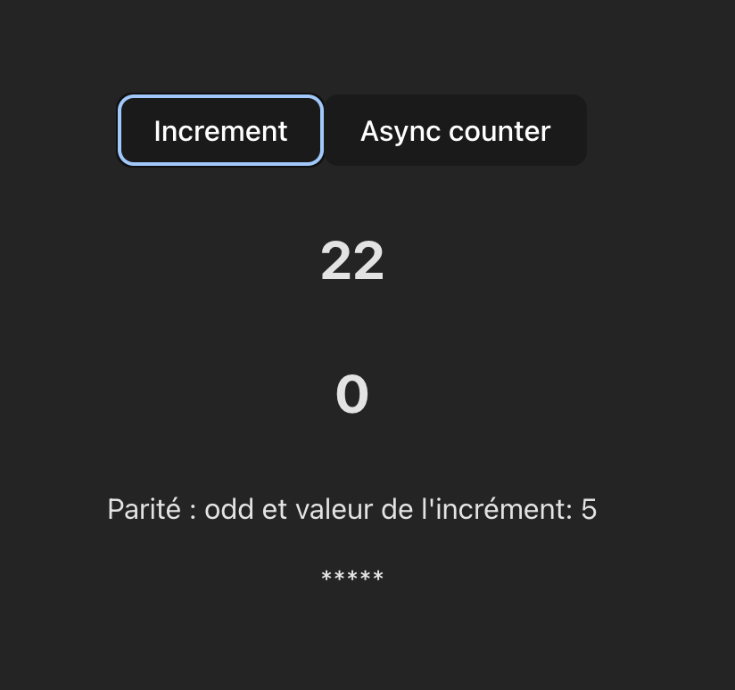

# Redux toolkit

Dans la suite du cours vous utiliserez **vite** comme bundle pour créer un nouveau projet.

```bash
npm create vite@latest
```

Puis pour installer un nouveau projet React on ajoute le nom de l'application et l'option --template react.

:shell:

```bash
# installer un nouveau projet en précisant l'utilisation de React
npm create vite@latest counter --template react

# installation des dépendances
npm install @reduxjs/toolkit

# pour binder avec des Hooks les fonctionnalités de reduxtoolkit dans React
npm install react-redux
```

## createSlice gestion du state

C'est une fonction, createSlice, qui accepte un état initial, et qui gère des créateurs d'action, permet de découper le state en plus petites parties autonomes.

- Exemple dans un fichier messageSlice.jsx

```js
// import de la fonction 
import { createSlice } from '@reduxjs/toolkit'

// définit un state 
const initialState = { message: '' }

const messageSlice = createSlice({
// clé permettant d'identifier le reducer spécifique 
  name: 'message',
  initialState,
  // gestions des actions dans le/les reducer(s) du state
  reducers: {
    changeMessage(state, action) {
      state.message = action.payload
    }
  },
})

// Export des actions
const store = configureStore({
     reducer: {
       e : messageSlice.reducer
    }
});

export const { changeMessage } = messageSlice.actions

// pour contextualiser le store dans l'arbre React
export default store;
```

Une fois que l'on a contextualisé le store de redux avec le component Provider de react-redux ( une autre dépendance installée), on doit utiliser ses hooks (react-redux), afin de pouvoir lire et/ou dispatcher des actions dans le state. Les actions de reduxtoolkit seront à exporter/importer.

```js
import { useDispatch, useSelector } from 'react-redux';
import { changeMessage } from './store/messageSlice';

// ...
```

### Exercice gestion de messages

> [!NOTE]
> Organisez le projet en dossiers et fichiers de manière logique en fonction des features demmandées.

1. Créez un projet app-message avec les dépendances redux toolkit vu précédemment.
1. Créez un store permettant de gérer l'ajout de messages et affichez ces messages dans un composant.
1. Implémentez les fonctionnalitées suivantes :
   - Créez une action qui permet de mettre tous les messages en majuscule
   - Créez une action permettant de mélanger l'ordre des messages

### Exercice counter synchrone

Rappelons que Redux gère les actions de manière synchrone.

Créez un compteur aléatoire en utilisant reduxtoolkit.

Dans la suite de l'exercice créez un dossier store dans l'application dans lequel vous implémenterez le code de vos createSlice.

1. Installez le projet **app-counter** avec vite (bundle).

2. Créez un bouton pour incrémenter une valeur de manière aléatoire.

3. Pour chaque valeur affichée; vous indiquerez si le nombre est pair ou impair. Aidez-vous de la remarque qui suit pour mettre en place cette fonctionnalité.

Remarque : Dans la partie reducers de votre slice (createSlice), vous pouvez découper une action en une fonction **reducer** et une fonction **prepare**, cette dernière fonction permet de gérer le payload, voyez l'exemple ci-dessous :

```js
reducers: {
        increment: {
            reducer: (state, action) => {}
        }
        prepare : () => ({payload : ...})
```

### Gestion d'un state asynchrone

On utilise dans cette exemple la fonction **createAsynchThunk**.

Une action asynchrone ne peut être dispatcher dans Redux sans passer par le middleware Thunk qui est intégré dans reduxtoolkit. En effet, toutes les actions dans Redux sont dispatchées de manière synchrone, **createAsynchThunk** attendra la résolution de la Promesse et dispatchera l'action dans le reducer de manière synchrone.

#### Mise en pratique

On définit d'abord la fonction asynchrone elle-même, par exemple :

```js
export const fetchUserById = createAsyncThunk(
  'users/fetchByIdStatus',
  async (userId: number, thunkAPI) => {
    const response = await userAPI.fetchById(userId)
    return response.data
  }
)
```

Puis dans la partie createSlice on peut préciser les états de la promesse:

```js
const usersSlice = createSlice({
  name: 'users',
  initialState : { entities : [] },
  reducers: {
  },
  extraReducers: (builder) => {
    builder.addCase(fetchUserById.pending, (state, action) => {
      // todo ?
    });
    builder.addCase(fetchUserById.fulfilled, (state, action) => {
      state.entities.push(action.payload)
    });
    builder.addCase(fetchUserById.rejected, (state, action) => {
        // todo ?
    })
  },
})
```

### 02 Exercice counter asynchrone

Reprendre l'exercice précédent sur le counter.

1. Définissez un compteur asynchrone dans une promesse.

2. Ajoutez un bouton permettant d'afficher une valeur incrémentée +1 de manière asynchrone en utilisant createAsynchThunk

### 03 Exercice middleware

Nous allons afficher une liste incrémentable d'étoiles dans le component principal; pour chaque incrémentation d'une valeur aléatoire pair ou impair, on affichera une étoile. Cette liste "graphique" sera placée sous les valeurs affichées par notre compteur précédent, voyez le wireframe ci-après.

Pour définir un middleware, précisez que l'on utilise thunk, cependant on utilisera l'autre méthode ci-après à l'aide de la fonction getDefaultMiddleware et de sa méthode concat pour ajouter nos middlewares au createStore. Notons que dans ce cas le middleware thunk est ajouté par défaut par reduxtoolkit.

```js
const store = configureStore({
  reducer: rootReducer,
  middleware: [thunk, logger],
})
```

Dans la fonction **createStore** ajoutez la fonction suivante pour la clé middleware:

```js

const middlewares = [
    ((store) => (next) => (action) => { /* ... */})
];

createStore({
    reducer { },
    middleware : (getDefaultMiddleware) =>getDefaultMiddleware().concat([ ...middlewares ] )
});
```

Rendu visuel


